# flutter_wigilabs_sr

Prueba técnica – Explorador de países de Europa con BLoC, Drift y Dio.

Arquitectura de **monorepo con Melos**, Clean Architecture por feature y soporte para Mobile, Web y Desktop.

## 🌐 Demo en vivo

**Web App:** [https://andresroviram.github.io/flutter_wigilabs_sr/](https://andresroviram.github.io/flutter_wigilabs_sr/)

La aplicación está desplegada automáticamente en GitHub Pages mediante GitHub Actions.

## Screenshots

### Mobile (Light Theme)
<br>
<p align="center">
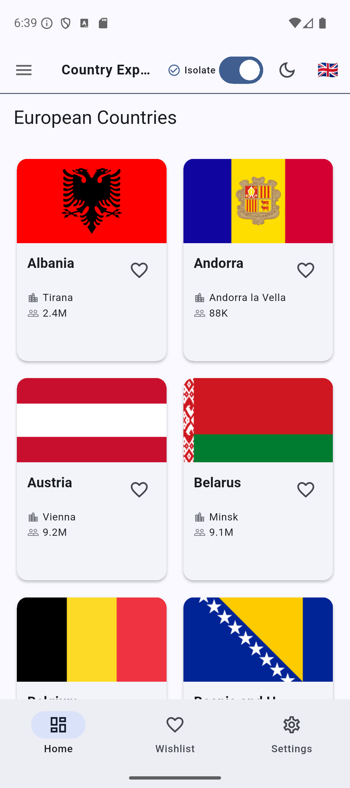
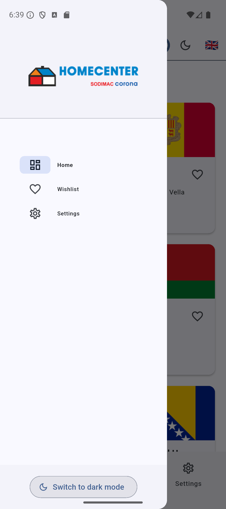
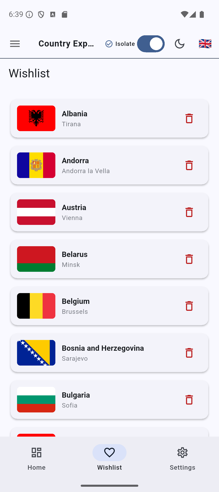
</p>

### Mobile (Dark Theme)
<br>
<p align="center">
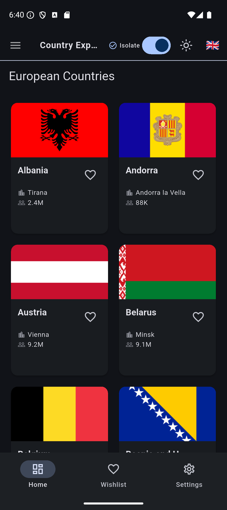
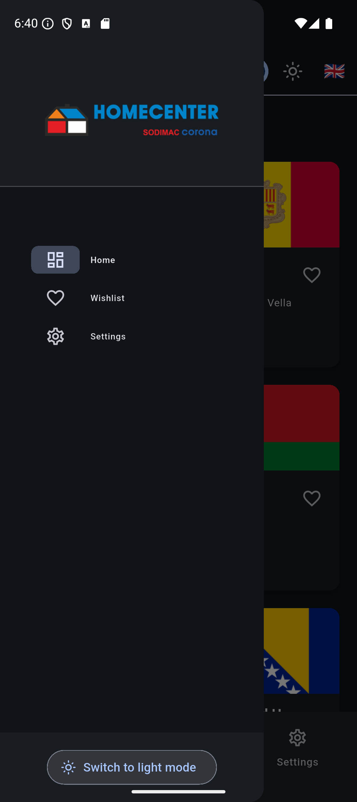
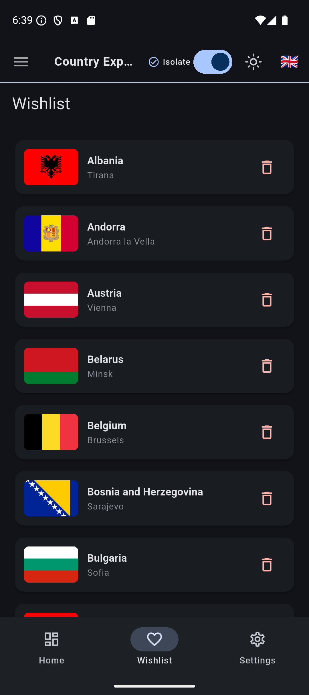
</p>

### Web (Light Theme)
<br>
<p align="center">
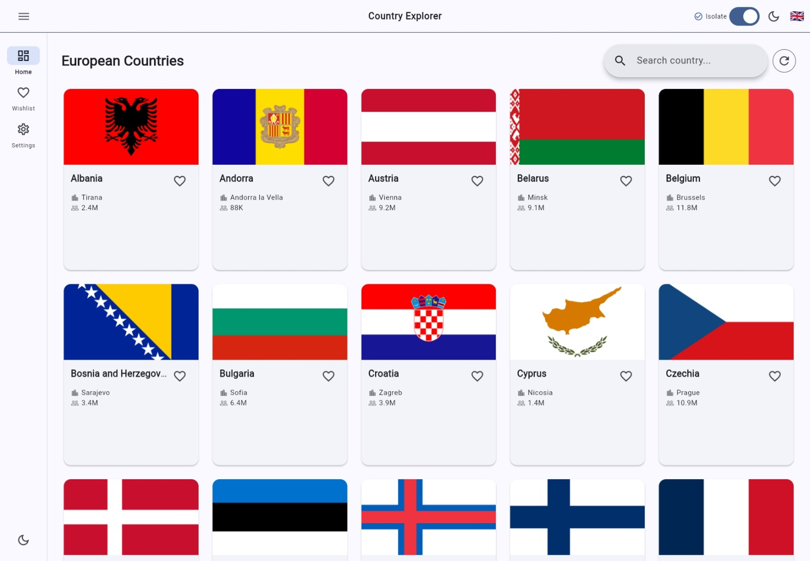
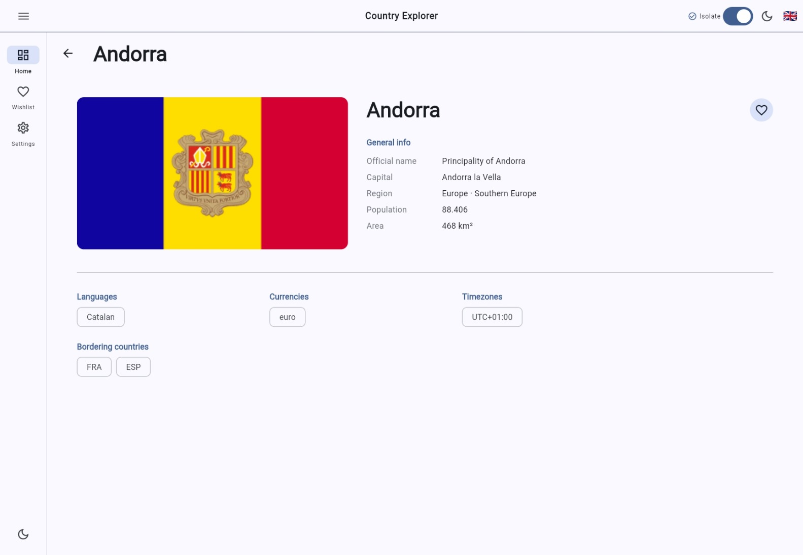
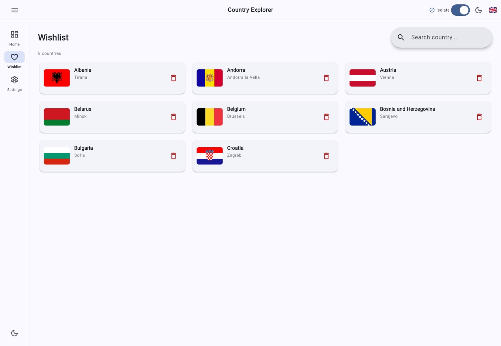
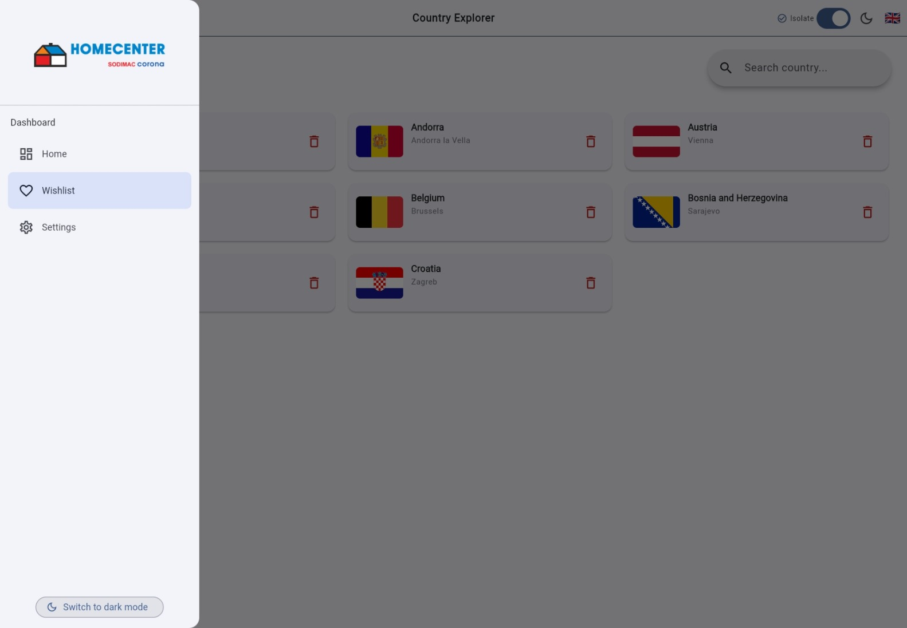
</p>

### Web (Dark Theme)
<br>
<p align="center">
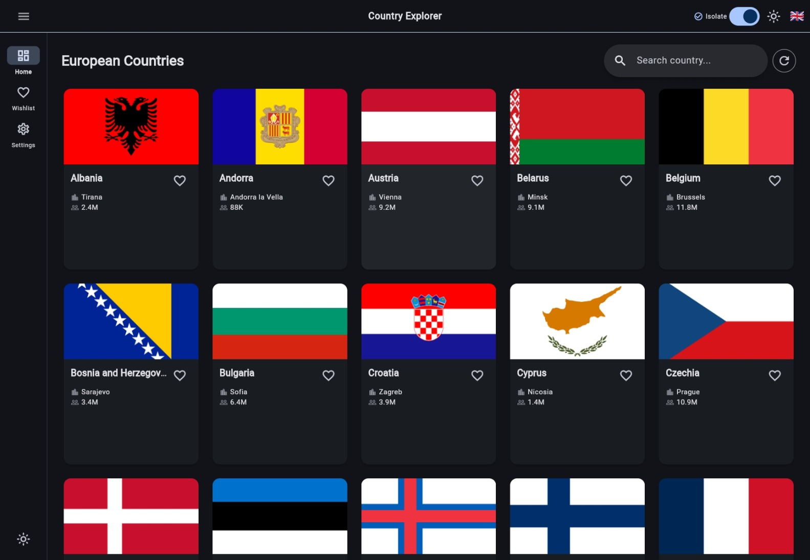
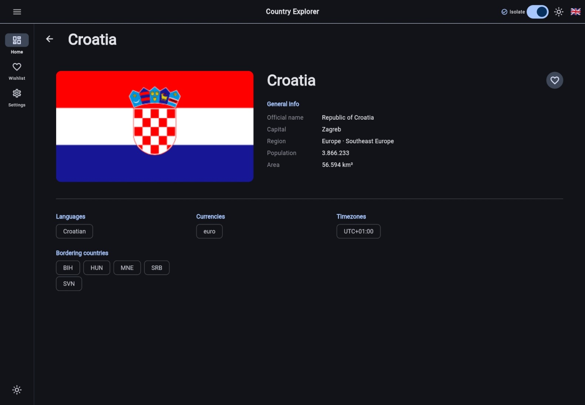
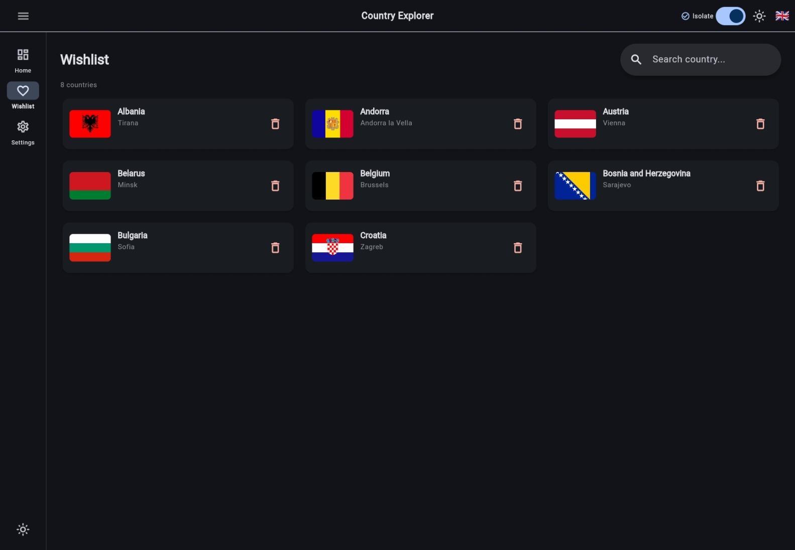
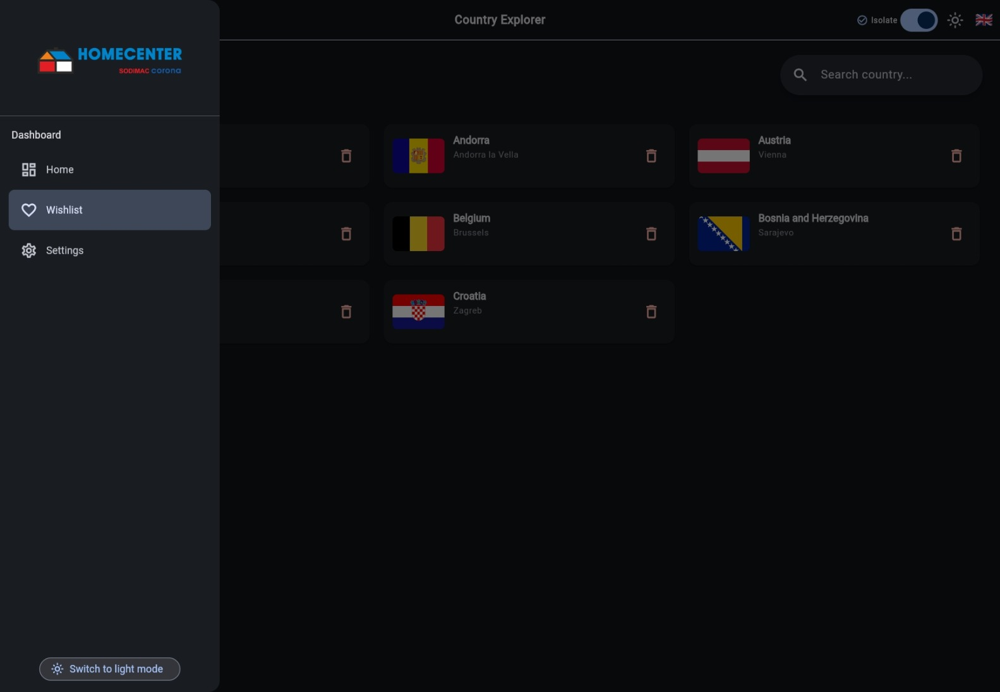
</p>

## Stack tecnológico

- Clean Architecture (por feature)
- Melos (monorepo management)
- BLoC (flutter_bloc) + hydrated_bloc
- go_router
- GetIt / Injectable
- freezed + json_serializable
- Dio (HTTP Client) + interceptores
- Exception Handling (Custom Error Management)
- Drift (SQLite – web & mobile)
- Performance Optimization (Jank Detection & Prevention)
- easy_localization
- adaptive_theme
- bot_toast
- cached_network_image
- [REST Countries API](https://restcountries.com/)

## Clean Architecture

Cada feature implementa Clean Architecture con tres capas:

- **Presentation**: UI, BLoC (states/events/cubit)
- **Domain**: Use cases, entities, repository interfaces
- **Data**: Repository implementations, datasources (remote & local), models

<br>
<p align="center">

</p>

## Estructura del monorepo

```
flutter_wigilabs_sr/          # Workspace raíz (Melos)
├── apps/
│   └── app/                  # Aplicación Flutter principal
│       ├── lib/
│       │   ├── main.dart
│       │   ├── my_app.dart
│       │   └── config/       # Router, DI, temas
│       └── web/              # Entrypoints y assets web
├── packages/
│   ├── core/                 # Capa compartida entre features
│   │   └── lib/
│   │       ├── domain/       # Entidades globales (CountryEntity…)
│   │       ├── error/        # Failures y manejo de errores
│   │       ├── network/      # Cliente Dio e interceptores
│   │       ├── performance/  # Detección de janks
│   │       └── utils/
│   │           └── isolates/ # CountryIsolateUtils (compute)
│   ├── database/             # Drift: tablas, DAOs, conexión web/mobile
│   ├── components/        # Widgets reutilizables y temas
│   └── features/
│       ├── home/             # Listado y detalle de países
│       ├── wishlist/         # Lista de deseos (favoritos)
│       └── settings/         # Idioma, tema y performance toggle
└── scripts/
    ├── setup_web.sh/.ps1     # Configura sqlite3.wasm y drift worker
    └── check_coverage.sh/.ps1 # Verifica umbral de cobertura
```

## Cómo ejecutar

Necesitas [Flutter](https://flutter.dev/docs/get-started/install) y [Melos](https://melos.invertase.dev) instalados.

```bash
# 1. Clonar el repositorio
git clone https://github.com/elkisrovira/flutter_wigilabs_sr.git
cd flutter_wigilabs_sr

# 2. Instalar Melos (si no lo tienes)
dart pub global activate melos

# 3. Bootstrap del workspace (instala dependencias de todos los packages)
melos bootstrap

# 4. Crear archivo .env en apps/app/
#    BASE_URL=https://restcountries.com/v3.1

# 5. Generar código (build_runner en todos los packages)
melos run build:all

# 6. Ejecutar la app
melos run run:mobile    # iOS/Android
melos run run:web       # Chrome (puerto 4000)
melos run run:desktop   # macOS
```

### Configuración web (Drift + SQLite)

Antes de ejecutar en web por primera vez:

```bash
# Linux/macOS
chmod +x scripts/setup_web.sh
./scripts/setup_web.sh

# Windows
.\scripts\setup_web.ps1
```

## Scripts de Melos

| Comando                    | Descripción                                           |
|----------------------------|-------------------------------------------------------|
| `melos bootstrap`          | Instala dependencias de todos los packages            |
| `melos run build:all`      | Ejecuta build_runner en packages que lo requieren     |
| `melos run build:watch`    | build_runner en modo watch                            |
| `melos run format`         | Verifica formato en todos los packages                |
| `melos run format:fix`     | Aplica formato en todos los packages                  |
| `melos run analyze`        | Análisis estático en todos los packages               |
| `melos run analyze:changed`| Análisis solo de packages modificados vs main         |
| `melos run test`           | Ejecuta todos los tests                               |
| `melos run test:coverage`  | Tests con reporte de cobertura                        |
| `melos run test:changed`   | Tests solo de packages modificados vs main            |
| `melos run clean:generated`| Elimina archivos .g.dart y .freezed.dart              |
| `melos run ci`             | Pipeline completo: analyze + format + test            |
| `melos run run:mobile`     | Lanza en iOS/Android                                  |
| `melos run run:web`        | Lanza en Chrome (puerto 4000)                         |
| `melos run run:desktop`    | Lanza en macOS Desktop                                |

## CI/CD & Despliegue

### 🔄 Continuous Integration (CI)

**Workflow:** `.github/workflows/ci.yml`

Se ejecuta automáticamente en cada push y pull request:

- ✅ Bootstrap con Melos
- ✅ Generación de código (build_runner vía `melos run build:all`)
- ✅ Verificación de formato (`melos run format`)
- ✅ Análisis estático (`melos run analyze`)
- ✅ Ejecución de tests con cobertura (`melos run test:coverage`)
- ✅ Reporte de cobertura a Codecov
- ✅ Verificación de umbral de cobertura (60%)

### 🚀 Despliegue Web

**Workflow:** `.github/workflows/deploy-web.yml`

**URL de producción:** [https://elkisrovira.github.io/flutter_wigilabs_sr/](https://elkisrovira.github.io/flutter_wigilabs_sr/)

Se ejecuta automáticamente al hacer push a `main` o `develop`:

- ✅ Build de la aplicación web con Flutter (desde `apps/app`)
- ✅ Ejecución de tests
- ✅ Despliegue automático a GitHub Pages

### 📱 Despliegue Android

**Workflow:** `.github/workflows/deploy-android.yml`

Despliega a Google Play Store cuando se hace push a `main` o ramas `release/*`:

- ✅ Build de APK/AAB firmado
- ✅ Fastlane para automatización
- ✅ Despliegue a diferentes tracks de Play Store

### 🍎 Despliegue iOS

**Workflow:** `.github/workflows/deploy-ios.yml`

Despliega a TestFlight/App Store cuando se hace push a `main` o ramas `release/*`:

- ✅ Build de IPA firmado
- ✅ Fastlane para automatización
- ✅ Gestión de certificados con match
- ✅ Despliegue a TestFlight o App Store

### 📋 Secrets requeridos en GitHub

**General:**
- `BASE_URL` – Base URL de la API (default: `https://restcountries.com/v3.1`)

**Android:**
- `ANDROID_KEYSTORE_BASE64` – Keystore codificado en base64
- `KEYSTORE_PASSWORD` – Contraseña del keystore
- `KEY_ALIAS` – Alias de la key
- `KEY_PASSWORD` – Contraseña de la key
- `PLAY_STORE_CONFIG_JSON` – Credenciales de servicio de Google Play

**iOS:**
- `MATCH_PASSWORD` – Contraseña para match (certificados)
- `MATCH_GIT_BASIC_AUTHORIZATION` – Autorización para repositorio de certificados
- `FASTLANE_USER` – Usuario de Apple Developer
- `FASTLANE_PASSWORD` – Contraseña de Apple ID
- `FASTLANE_APPLE_APPLICATION_SPECIFIC_PASSWORD` – Contraseña específica de app
- `APP_STORE_CONNECT_API_KEY_ID` – ID de la API key de App Store Connect
- `APP_STORE_CONNECT_API_ISSUER_ID` – Issuer ID de App Store Connect
- `APP_STORE_CONNECT_API_KEY` – API Key de App Store Connect

**Coverage:**
- `CODECOV_TOKEN` – Token para reportar cobertura a Codecov

## Features

- 🌍 Explorador de países de Europa
- 🔍 Búsqueda y filtrado de países
- ❤️ Lista de deseos (wishlist) con persistencia local
- 💾 Almacenamiento local con Drift (SQLite – web & mobile)
- 🌐 Soporte multi-idioma (Español/Inglés)
- 🎨 Tema claro/oscuro adaptativo
- 📱 Diseño responsive (Mobile, Tablet, Web, Desktop)
- ⚡ Caché de imágenes
- 🔄 Manejo de estados con BLoC
- 🌐 Peticiones HTTP con Dio e interceptores
- ⚠️ Manejo robusto de excepciones y errores
- 🚀 Optimización de performance (detección y prevención de janks con isolates)
