# flutter_wigilabs_sr

Prueba técnica – Explorador de países de Europa con BLoC, Drift y Dio.

## Screenshots

### Mobile (Light Theme)
<br>
<p align="center">
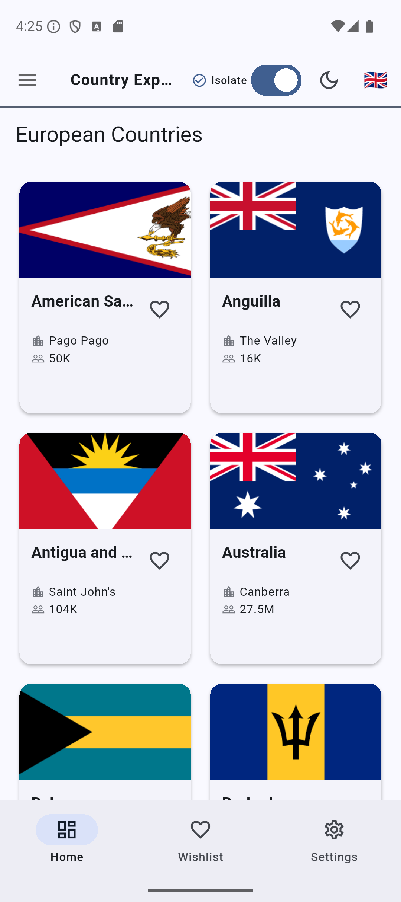
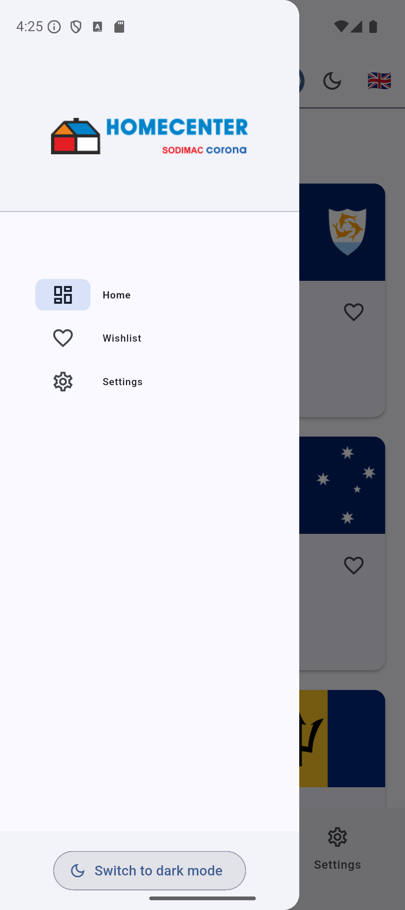

</p>

### Mobile (Dark Theme)
<br>
<p align="center">

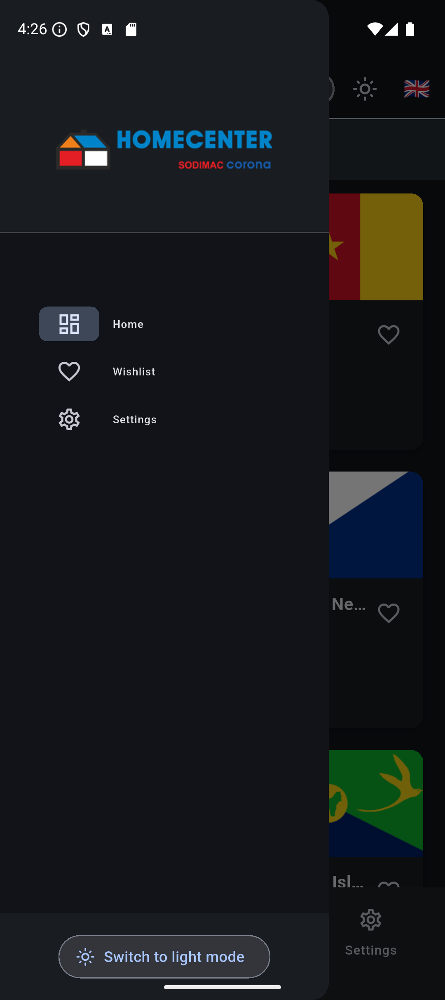
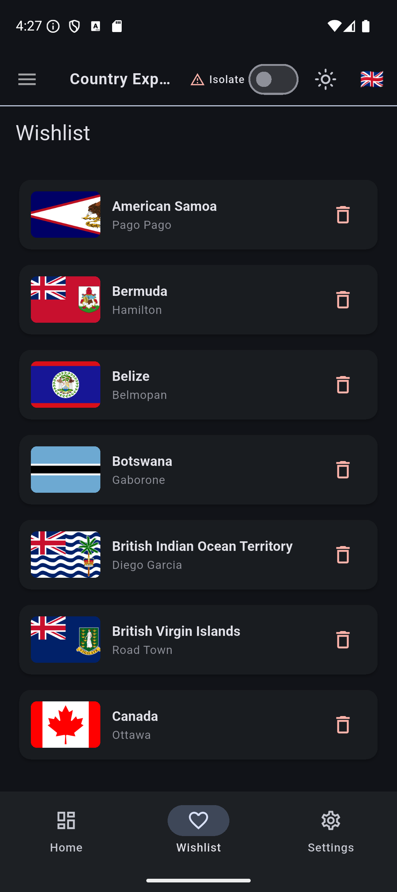
</p>

### Web (Light Theme)
<br>
<p align="center">
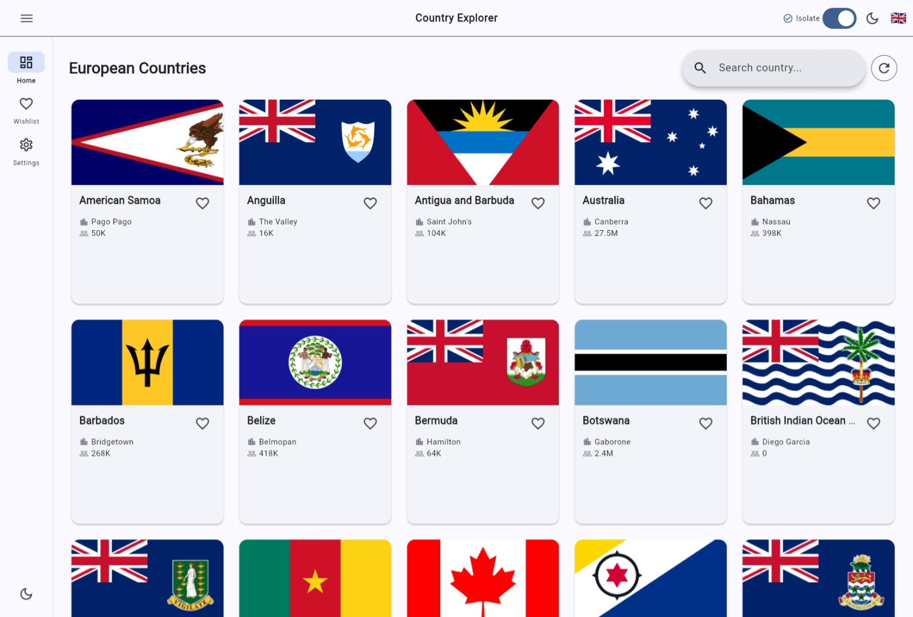
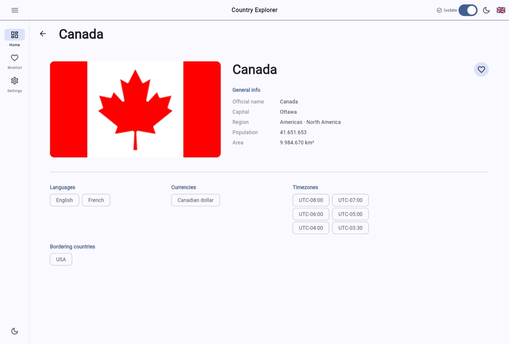
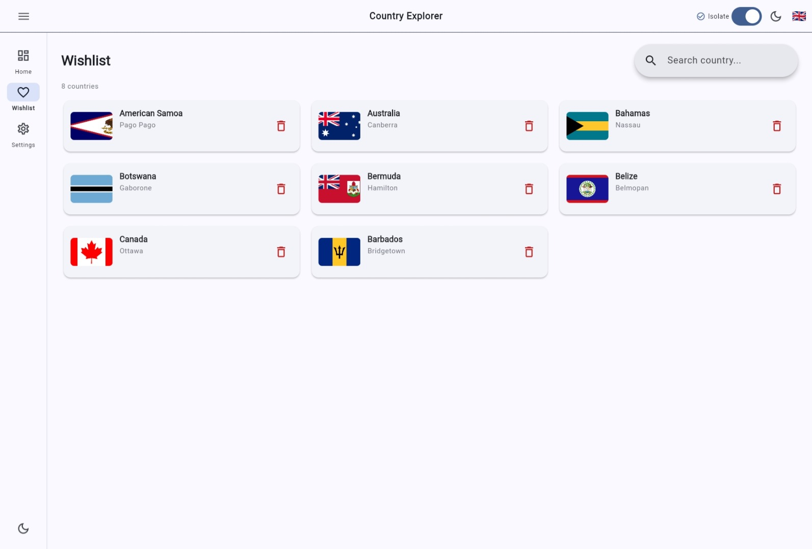
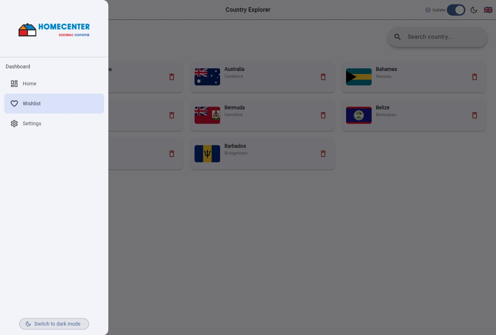
</p>

### Web (Dark Theme)
<br>
<p align="center">
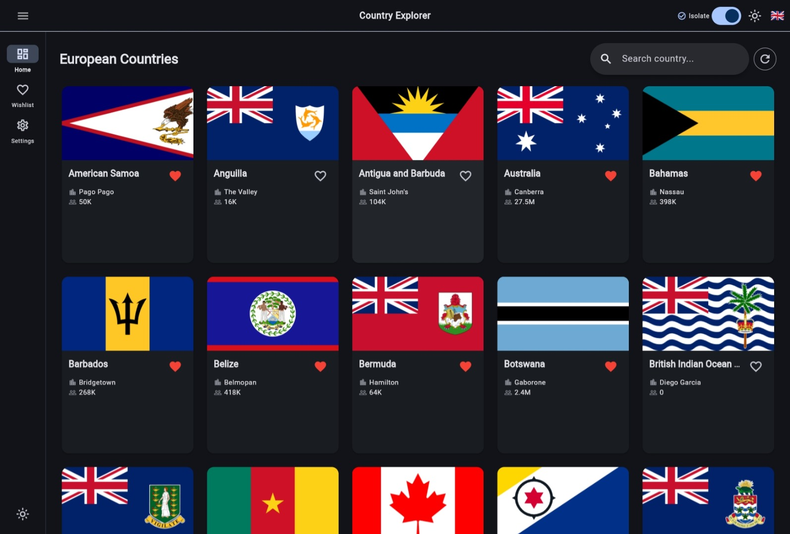
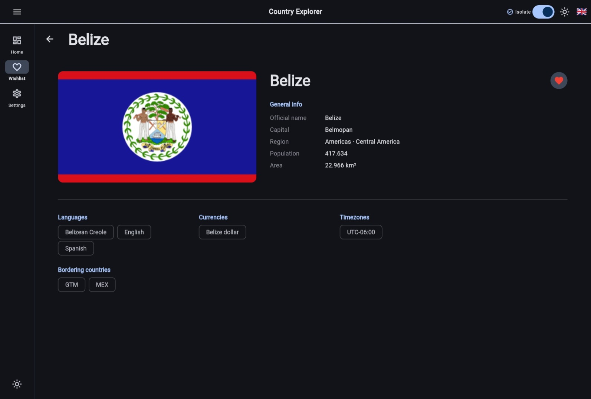
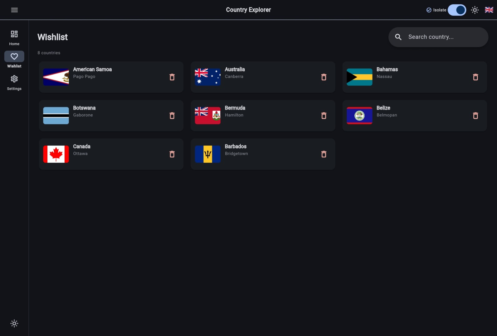
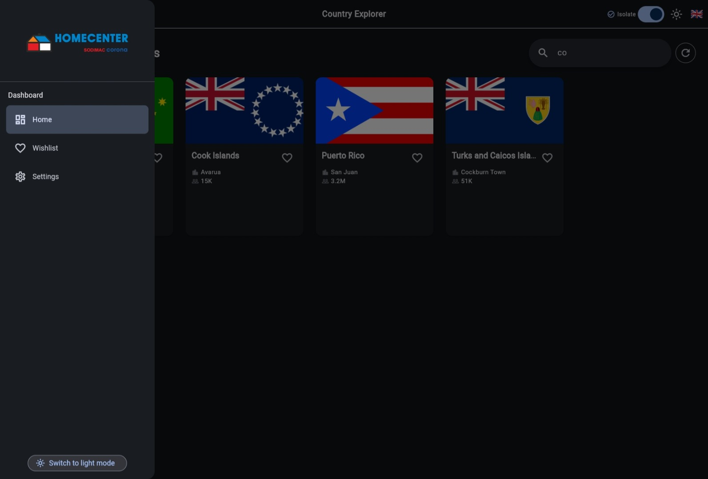
</p>

## Using on this app

- Clean Architecture
- BLoC (flutter_bloc)
- go_router
- GetIt / Injectable
- freezed
- json_serializable
- Dio (HTTP Client) + interceptores
- Exception Handling (Custom Error Management)
- Drift (SQLite Database)
- Performance Optimization (Jank Detection & Prevention)
- easy_localization
- adaptive_theme
- bot_toast
- cached_network_image
- [REST Countries API](https://restcountries.com/)

## Clean Architecture

Este proyecto implementa Clean Architecture con la siguiente estructura de capas:

- **Presentation Layer**: UI components, BLoC state management
- **Domain Layer**: Use cases, entities, repository interfaces
- **Data Layer**: Repository implementations, data sources (remote & local), models

## How to use

Para clonar y ejecutar esta aplicación, necesitarás tener [Git](https://git-scm.com/downloads) y [Flutter](https://flutter.dev/docs/get-started/install) instalados en tu computadora. Desde tu línea de comandos:

```bash
# Clonar este repositorio
$ git clone https://github.com/yourusername/flutter_wigilabs_sr.git

# Ir al directorio del repositorio
$ cd flutter_wigilabs_sr

# Instalar dependencias
$ flutter pub get

# Crear archivo .env en la raíz del proyecto
$ API_KEY=''
$ BASE_URL='https://restcountries.com/v3.1'

# Generar código
$ dart run build_runner build --delete-conflicting-outputs

# Ejecutar la aplicación
$ flutter run

# Para web
$ flutter run -d chrome
```

## Project Structure

```
lib/
├── main.dart
├── my_app.dart
├── components/         # UI components reutilizables
├── config/             # Configuración de la app
├── core/               # Utilidades y core features
└── modules/            # Módulos de características
    └── [feature]/
        ├── data/
        ├── domain/
        └── presentation/
```

<br>
<p align="center">

</p>

## Features

- 🌍 Explorador de países de Europa
- 🔍 Búsqueda y filtrado de países
- 💾 Almacenamiento local con Drift (SQLite)
- 🌐 Soporte multi-idioma (Español/Inglés)
- 🎨 Tema claro/oscuro adaptativo
- 📱 Diseño responsive (Mobile, Tablet, Web)
- ⚡ Caché de imágenes
- 🔄 Manejo de estados con BLoC
- 🌐 Peticiones HTTP con Dio e interceptores
- ⚠️ Manejo robusto de excepciones y errores
- 🚀 Optimización de performance (detección y prevención de janks)
